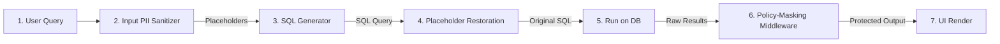

# Domain & Database Migration Guide

This guide explains how to adapt the Agentic NL2SQL application to a completely different business domain (such as E-commerce, Finance, or CRM) and database engine with **zero backend Python or frontend Javascript code modifications**.

The application utilizes a fully decoupled architecture where data mappings, security policies, and natural language prompts are loaded dynamically from configuration files.

---

## The Migration Checklist

To port the application to a new domain, you only need to update or modify these **three files**:

```
NL2SQL/
├── backend/
│   ├── .env                       # 1. Update Database connection settings
│   ├── semantic_layer.yaml        # 2. Define schema entities & security policies
│   └── prompts/
│       ├── sql_generation.txt     # 3a. Update LLM translation instruction
│       └── summarization.txt      # 3b. Update LLM conversational summary persona
```

---

## Step 1: Update Connection Credentials (`backend/.env`)

Configure the backend to point to your new database location and update credentials.
Modify the following values:

```bash
# 1. Database Connection URI
# Local SQLite example:
DATABASE_URL=sqlite:///c:/path/to/your/new_data.db

# Or Cloud Databricks / Snowflake / PostgreSQL SQL Warehouse example:
DATABRICKS_HOST=your-workspace-hostname.cloud.databricks.com
DATABRICKS_TOKEN=dapi-your-personal-access-token
DATABRICKS_HTTP_PATH=/sql/1.0/warehouses/your-http-path
DATABRICKS_CATALOG=ecom_catalog
DATABRICKS_SCHEMA=sales_schema

# 2. API Keys for LLM Engines
SARVAM_API_KEY=your_new_sarvam_key
OPENAI_API_KEY=your_new_openai_key
```

---

## Step 2: Define Schema & Security Policies (`backend/semantic_layer.yaml`)

This YAML configuration is the core of the decoupled design. Replace the medical definitions with your new domain mapping.

### A. Logical to Physical Field Mappings
Map your logical entities to database tables, and tag sensitive columns with data classifications (e.g. `pii_name`, `pii_email`, `financial`):

```yaml
entities:
  Customer:
    table_name: "customers"
    primary_key: "customer_id"
    description: "Represents consumer profiles and accounts."
    fields:
      id: "customer_id"
      name:
        column_name: "full_name"
        classification: "pii_name"
      phone:
        column_name: "phone_number"
        classification: "pii_phone"
      email:
        column_name: "email_address"
        classification: "pii_email"
      region: "sales_region" # Unclassified (fully visible to everyone)

  Order:
    table_name: "orders"
    primary_key: "order_id"
    description: "Represents purchase transactions."
    fields:
      id: "order_id"
      customer_id: "customer_id"
      sales_rep_id: "sales_rep_id"
      revenue:
        column_name: "net_sales"
        classification: "financial"
```

### B. Table Join Mappings
Define join rules. The agent uses these joins automatically rather than guessing join fields:

```yaml
relationships:
  - from_entity: "Order"
    to_entity: "Customer"
    join_type: "many_to_one"
    join_keys:
      from_key: "customer_id"
      to_key: "customer_id"
```

### C. Security Policies (RBAC/ABAC)
Define corporate roles and masking rules. The middleware loads these rules at runtime to redact and filter query results on-the-fly:

```yaml
security_policies:
  roles:
    # 1. Administrators see everything raw
    admin:
      clearance: "unrestricted"
      
    # 2. Auditors see trends but no patient/client personal details
    auditor:
      masking_rules:
        pii_name: "mask_name"       # John Doe -> J*** D**
        pii_phone: "mask_phone"     # +1-555-0101 -> ***-***-****
        pii_email: "mask_email"     # mail@domain.com -> m***@***.com
        financial: "redact"         # Replaces numerical fields with [RESTRICTED]
        
    # 3. Sales Representatives only see customer names in their assigned region (ABAC)
    sales_rep:
      masking_rules:
        financial: "redact"         # Hide net sales numbers
      abac_policies:
        - entity_context: "Customer"
          attribute_match:
            user_attribute: "region"
            db_column: "sales_region"
          fallback_action: "mask"    # Mask name/phone if patient is in another region
```

---

## Step 3: Swap LLM Persona Prompts (`backend/prompts/`)

Modify the instruction texts inside the prompt templates so the LLM assumes the vocabulary and persona of the target domain.

### A. SQL Generation Instructions (`prompts/sql_generation.txt`)
Modify instructions to restrict dialect types or enforce company query behaviors:
```text
You are a retail sales database engineering expert. Generate the correct query matching the schema and semantic layer rules below.
...
Rules:
- Never query passwords or hashed client credit cards.
- Enforce standard PostgreSQL query syntax.
```

### B. Natural Language Summarizer (`prompts/summarization.txt`)
Modify the persona to dictate how output tables are narrated to the user:
```text
You are a retail sales analyst. Write a clean, brief response answering the user's business question based on the query results. Keep it concise.
```

---

## How it Works under the Hood

When a user submits a question, the application executes the security and execution steps automatically:



1.  **Input Sanitization**: Phone numbers, emails, and SSNs in the question are extracted and replaced with placeholders (e.g., `PII_PARAM_0`) before hitting the LLM.
2.  **SQL Translation**: The LLM writes standard SQL using schema parameters and placeholders.
3.  **Restoration**: Before execution, placeholders are substituted with the original search terms in-memory.
4.  **Database Execution**: The database executes the query and returns the results.
5.  **Dynamic Masking**: The middleware inspects the returned column headers. It resolves their classifications from `semantic_layer.yaml` and applies the user's active role policies dynamically.
