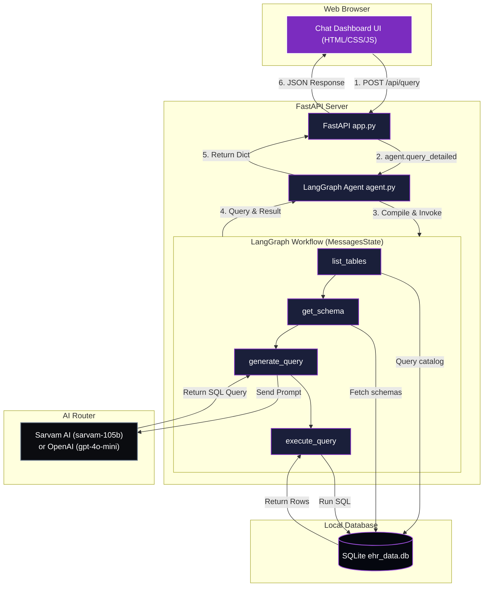

# EHR Natural Language to SQL (NL2SQL) Agent

An agentic AI application that translates plain English questions into SQL queries, executes them against an Electronic Health Records (EHR) database, and renders the results dynamically. Powered by **LangGraph**, **LangChain**, **FastAPI**, and **Sarvam AI / OpenAI**.

## Features

*   **Agentic LangGraph Pipeline**: A 4-stage sequential state graph (`list_tables` -> `get_schema` -> `generate_query` -> `execute_query`) with built-in query syntax error handling.
*   **Dual LLM Router**: Detects and boots specialized primary models (e.g. `sarvam-105b`) when a Sarvam API key is provided, cascading to OpenAI (`gpt-4o-mini`) as a backup layer.
*   **FastAPI Backend Server**: Exposes REST API routes for executing natural language queries and fetching reflected database table schemas.
*   **Premium Chat Dashboard**: A beautiful, dark glassmorphic single-page web client that displays:
    *   A live sidebar browser of database tables and columns.
    *   The generated SQL statements with a one-click copy button.
    *   Dynamic, responsive HTML tables generated from SQL query outputs.


## Architecture Diagram



---

## Project Structure

```
NL2SQL/
├── backend/
│   ├── agent.py             # LangGraph state machine & LLM connection
│   ├── app.py               # FastAPI web server and routes
│   ├── requirements.txt     # Python dependencies for the backend
│   ├── .env                 # API Keys (gitignored)
│   └── ehr_data.db          # SQLite Database (gitignored)
├── frontend/
│   ├── index.html           # Dashboard UI
│   ├── style.css            # Glassmorphic dark styling
│   └── app.js               # Frontend fetch and DOM rendering logic
├── .gitignore               # Ignored cache, databases, and secrets
├── README.md                # Project documentation
└── requirements.txt         # Root requirements pointing to backend
```

---

## Setup & Run Instructions

### Prerequisites
*   Python 3.10 or higher
*   Git

### 1. Clone & Navigate
```bash
git clone https://github.com/Tpg1993/nl2sql.git
cd nl2sql
git checkout v1_sarvam_local_sql
```

### 2. Set Up Virtual Environment
Create and activate a Python virtual environment:
```bash
# Windows PowerShell
python -m venv .venv
.venv\Scripts\Activate.ps1

# Linux / macOS
python3 -m venv .venv
source .venv/bin/activate
```

### 3. Install Dependencies
```bash
pip install -r backend/requirements.txt
```

### 4. Configure Environment Variables
Create a `.env` file inside the `backend/` directory:
```bash
# Inside backend/.env
SARVAM_API_KEY=your_sarvam_api_key_here
OPENAI_API_KEY=your_openai_api_key_here # Fallback backup
```

### 5. Setup Database
Ensure your populated SQLite database is placed in the `backend/` directory:
*   File path: `backend/ehr_data.db`

---

## Running the Application

### Start the Backend Server
Run the FastAPI development server using uvicorn:
```bash
# Ensure virtual environment is active
uvicorn backend.app:app --host 127.0.0.1 --port 8000 --reload
```
The API docs will be available at `http://127.0.0.1:8000/docs`.

### Launch the Frontend Dashboard
Simply open the `frontend/index.html` file in any modern web browser (e.g. Chrome, Firefox, Safari) by double-clicking it. It will connect to the local API automatically! Alternatively, if the frontend server is running, visit `http://localhost:3000`.

---

## Verification & Test Suite

To verify the accuracy and performance of the agent, we have compiled a set of simple, medium, and complex questions with their expected SQL translations:
👉 **[EHR Test Cases & Verification Prompts](test_cases.md)**

