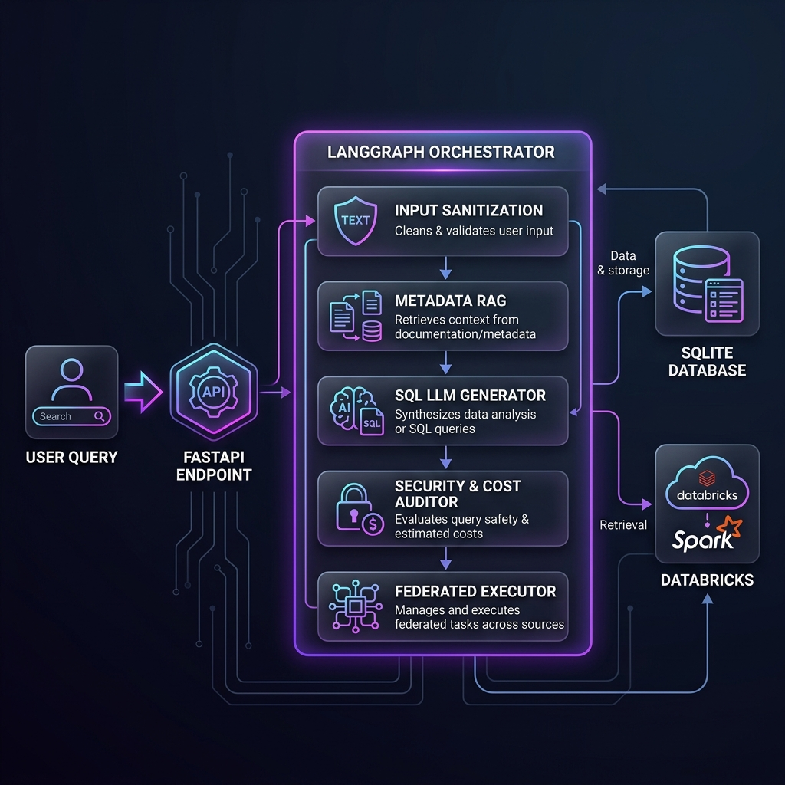
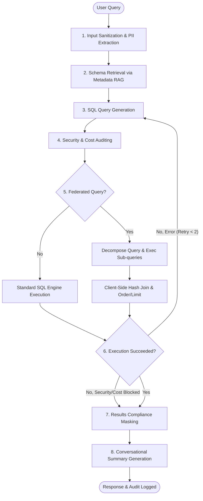

# System Architecture & API Catalog

This document details the agentic architecture, compliance framework, and backend API endpoints of the EHR NL2SQL Query System.

---

## 1. Agentic Architecture (LangGraph Engine)

The core query engine is implemented as a multi-node agent state machine utilizing **LangGraph** (`backend/agent.py`), designed for natural language translation to SQL, validation, query optimization, safe execution, and compliance filtering.

### 1.1 State Machine Node Breakdown

#### 1. **Input Sanitization & PII Extraction**
*   **Purpose**: Intercepts sensitive data in the natural language question to protect user privacy.
*   **Logic**: RegEx rules extract emails, phone numbers, and SSNs. They are replaced by placeholders (`PII_PARAM_0`, etc.) in the question, and mapped inside the graph state (`pii_params`) to be restored *only* during physical execution.

#### 2. **Schema Retrieval (Metadata RAG)**
*   **Purpose**: Dynamically selects relevant schema context to minimize prompt size and avoid context limit errors.
*   **Logic**: Matches the question against the database tables using semantic text indexing (`backend/metadata_rag.py`). Only the top 3 matching tables' DDL schemas are fetched (using `sql_db_schema`), resulting in substantial RAG prompt savings.

#### 3. **SQL Query Generation**
*   **Purpose**: Translates the user's natural language request into a valid SQL query.
*   **Logic**:
    1.  **Expert Override Check**: First queries the RLHF override cache (`backend/expert_overrides.py`). If a matching question exists, returns the approved SQL query directly.
    2.  **Few-Shot Retrieval**: Pulls matching query examples from `FewShotLibrary` (`backend/few_shot_library.py`).
    3.  **Prompt Assembly**: Combines context (logical entities, relationships, metrics, schema DDL, few-shot examples, chat history, and any previous SQL execution errors) to generate the query using the LLM.

#### 4. **Security & Cost Auditing**
*   **Security AST Audit**: Parses the generated SQL with `sqlglot` to block write/alter commands (e.g., `INSERT`, `UPDATE`, `DROP`, `ALTER`, `PRAGMA`).
*   **Cost Planner Audit**: Explains the SQL plan (`backend/planner.py`) to count estimated scanned rows (blocked if $\ge 5000$) or identify dangerous Cartesian products/cross-joins. Administrators or users in the `HighPerformanceQueryGroup` bypass cost constraints.
*   **Query Wrapping**: Enforces a `LIMIT 100` clause dynamically if no query limit is provided.

#### 5. **Federated Query Engine**
*   **Decomposition**: Checks if the query references tables spanning multiple database environments (e.g., local SQLite EHR, local SQLite billing, and remote Databricks warehouse).
*   **Optimization**: Pushes query filters downstream. Performs **Semi-Join Pushdown** by selecting candidate keys from the local database first, injecting them inside an `IN` constraint into the remote query.
*   **Execution & Join**: Sub-queries are run independently. Results are cached and merged client-side via a client-side hash join, applying sorting/limits on the final unified dataset.

#### 6. **Self-Healing Error Correction (Retry Loop)**
*   If SQL execution fails with database engine errors, the error context is injected back into the prompt, routing back to Node 3 to generate a corrected query (maximum of 2 retry attempts). Security and Cost violations skip retries and fail immediately.

#### 7. **Results Compliance Masking**
*   Applies Role-Based Access Control (RBAC) and Attribute-Based Access Control (ABAC) filters onto the raw query dataset using policies configured in `backend/semantic_layer.yaml` (e.g., masking PII column fields for researchers, enforcing department matches for doctors).

#### 8. **Conversational Summary**
*   Prompts the LLM with the compliance-masked dataset and original question to output a user-friendly conversational summary.

---

## 2. Compliance & Security Framework

The compliance layer (`backend/semantic_layer.py`) governs data redaction based on user authentication contexts:

1.  **Clearance Roles**:
    *   `admin`: Unrestricted database access and configuration privileges.
    *   `doctor`: Field-level masking rules (e.g., financial columns redacted). Applies **ABAC (Attribute-Based Access Control)** matching patient departments to the doctor's department (unmatched patient fields are masked).
    *   `researcher`: Column-level masking rules (e.g., `pii_name` masked with initials, `pii_dob` masked, phone and email masked, financial fields redacted).
2.  **Audit Ledger**:
    *   `backend/audit_ledger.py` records every executed query in `backend/audit_ledger.db` with columns for username, role, latency, prompt, SQL statement, and result hashes.
    *   The ledger maintains an **immutable cryptographic hash chain** (similar to a blockchain block registry) to prevent tampering.

---

## 3. Backend API Catalog (FastAPI)

Implemented in [backend/app.py](backend/app.py), the backend exposes APIs categorized into Authentication, Query Engine, Configuration, and Auditing.

| HTTP Method & Path | Access Level | Purpose | LLM Required? |
| :--- | :--- | :--- | :---: |
| `POST /api/auth/token` | Public / All Users | Authenticates user credentials and issues a signed JWT token containing role claims and ABAC attributes. | No |
| `POST /api/query` | Authenticated Users | Translates natural language queries to SQL, validates security/costs, runs local or federated execution, masks PII, and generates clinical summaries. | **Yes** |
| `GET /api/history/{thread_id}` | Authenticated Users | Retrieves chat history turns for a session with dynamic PII masking/ABAC filters applied. | No |
| `POST /api/feedback` | Authenticated Users | Submits thumbs up/down rating and comments for generated SQL queries. | No |
| `GET /api/metadata` | Authenticated Users | Reflects physical schema tables and columns across active connection engines for front-end sidebar representation. | No |
| `POST /api/expert-override` | Administrators | Registers/updates an expert query SQL translation override (RLHF). | No |
| `GET /api/config/semantic-layer` | Administrators | Retrieves the active `semantic_layer.yaml` configuration alongside physical DB schema information. | No |
| `POST /api/config/semantic-layer` | Administrators | Validates, updates, and hot-reloads the semantic layer yaml configuration and flushes database cache. | No |
| `POST /api/config/test-metric` | Administrators | Dry-runs/compiles a custom metric SQL formula on the active DB pool using query plans. | No |
| `GET /api/config/discover` | Administrators | Automatically inspects and discovers entities and primary/foreign key join relationships across DB engines. | No |
| `GET /api/config/audit-logs` | Administrators | Retrieves complete logs from the immutable audit ledger database. | No |
| `GET /api/config/verify-audit-ledger` | Administrators | Executes hash chain verification checks on the audit database to detect tampering. | No |
| `GET /api/config/git-info` | Administrators | Retrieves git repository status, branch lists, and GitHub API token verification metadata. | No |
| `POST /api/config/gitops/pr-sync` | Administrators | Commits/pushes local semantic layer modifications to origin and opens/updates a GitHub Pull Request. | No |
